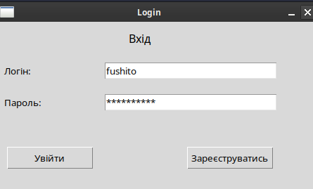
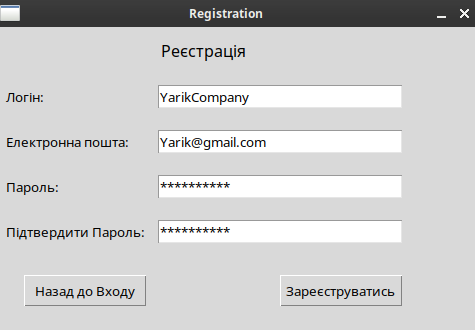
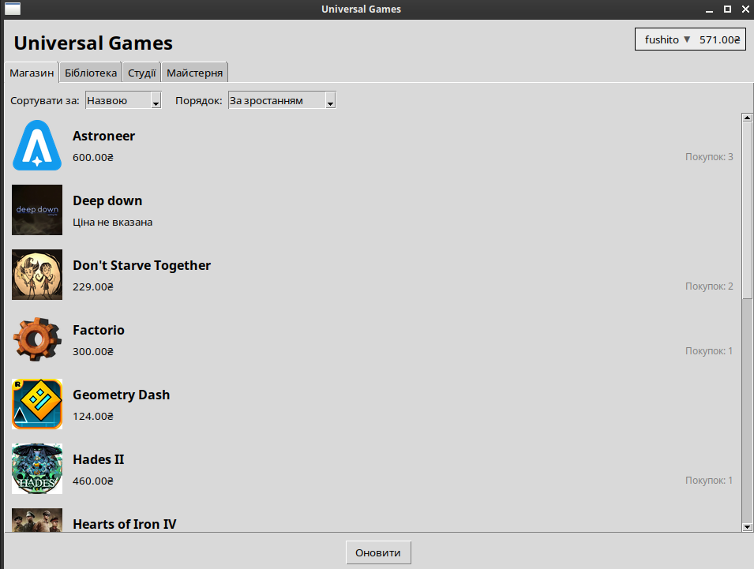
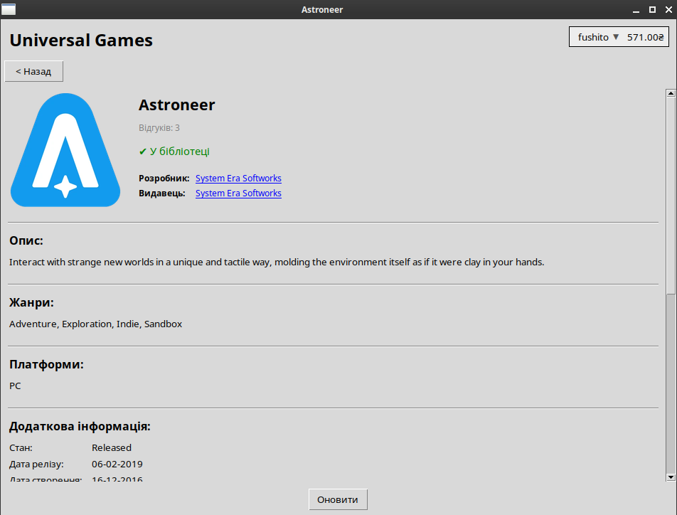
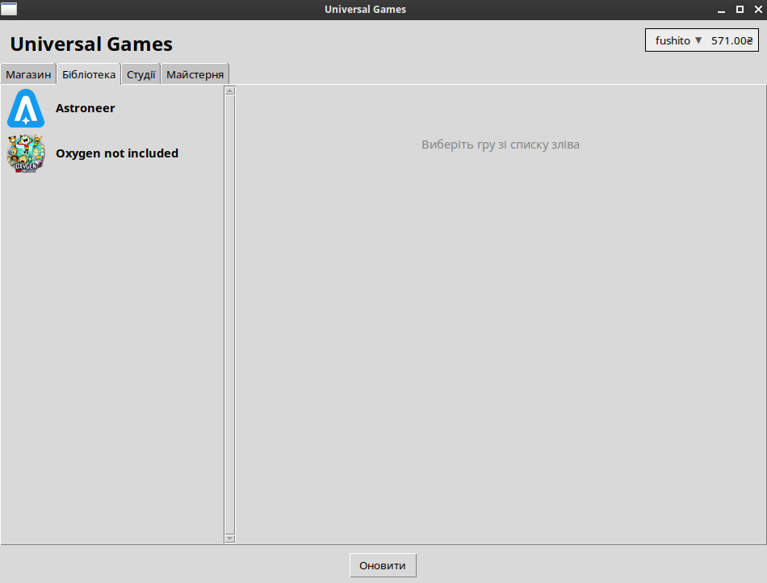
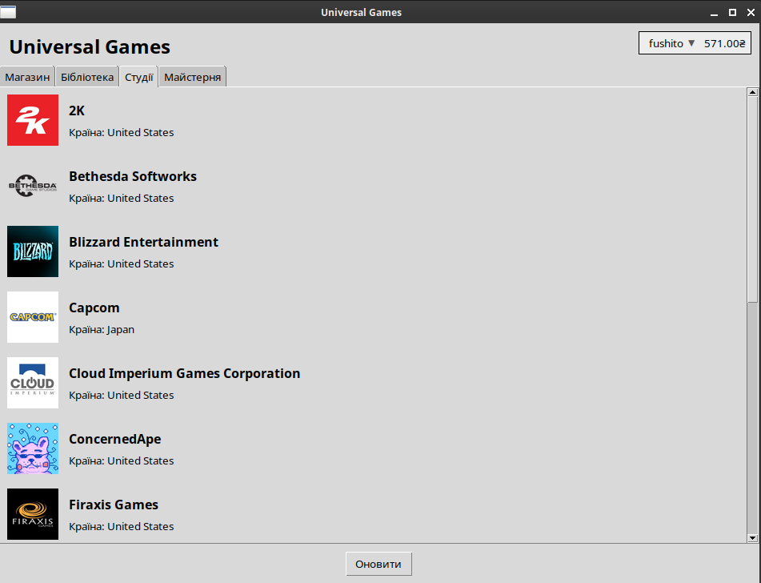
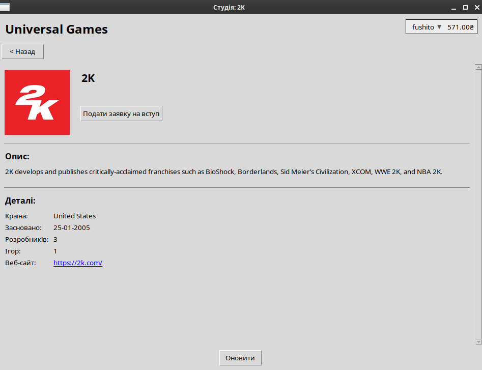
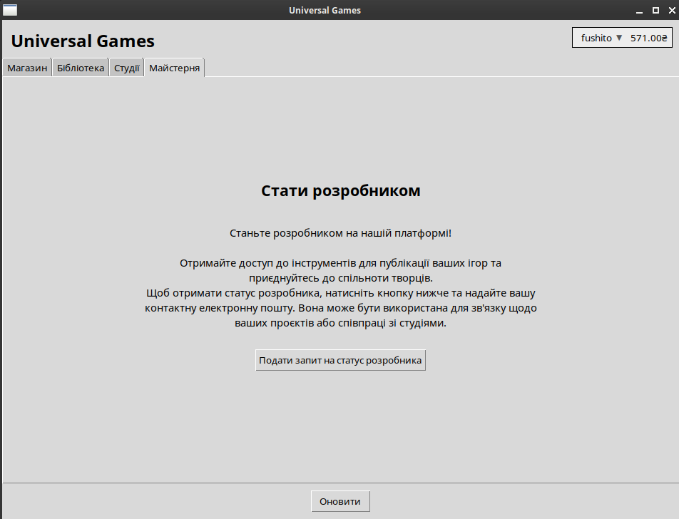
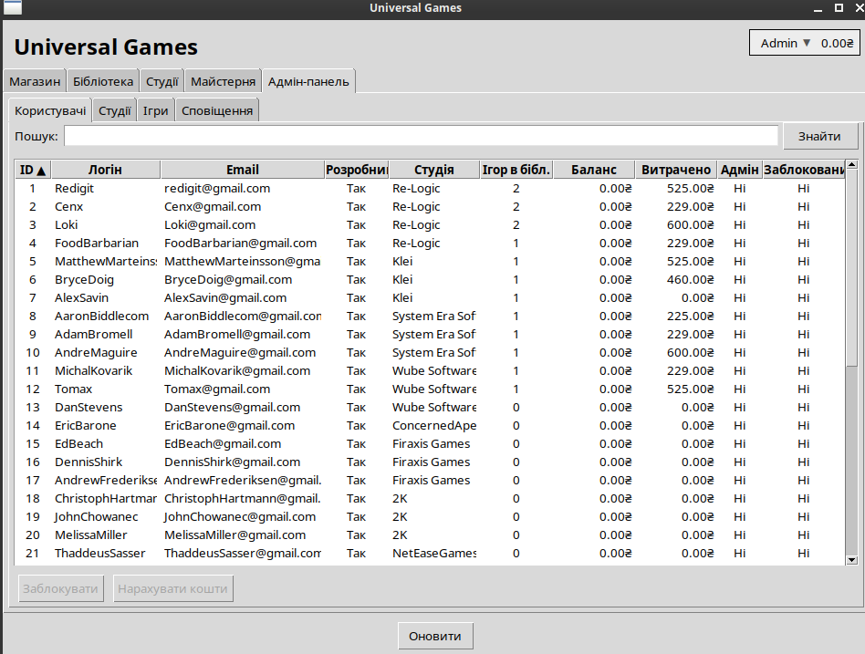

# **Universal Games Store**

A desktop application for browsing, purchasing, and managing computer games, featuring a dedicated portal for game studios and developers, and an admin panel for system management.
This term paper is a store for games

## **Table of Contents**
- [Key Features](#key-features)
- [Technologies Used](#technologies-used)
- [Project Structure](#project-structure)
- [Setup and Running](#setup-and-running)
- [Screenshots](#screenshots)
- [Future Enhancements](#future-enhancements)
- [Author](#author)
## Key Features
- ### For Users:
    - User registration and login.
    - Game catalog browsing with sorting options (by title, price).
    - Detailed game information view (description, genres, platforms, developers, publishers, reviews).
    - Game purchasing (with balance check).
    - Viewing personal library of purchased games.
    - Ability to write game reviews and comment on other reviews.
    - Adding funds to user balance (implemented via admin panel, but can be mentioned as a feature).
    - Deleting own user account.
- ### For Developers/Studios:
    - Ability to apply for developer status.
    - Ability to apply to join an existing studio.
    - (planned) Ability to create their game pages.
    - (planned) Studio member management (for studio admins).
    - Ability to leave a studio.
- ### For App Admins:
    - User management panel (view, search, sort, ban/unban, add funds).
    - Studio management panel (view, search, sort).
    - Game management panel (view, search, sort, edit description/price).
    - Reviewing and processing developer status requests.
- ### General:
    - Data persistence using a PostgreSQL database.
    - Graphical User Interface (GUI) built with Tkinter.
    - Test data population via a separate script.
## Technologies Used
- **Programming Language:** Python 3.12.3
- **Graphical User Interface (GUI):** Tkinter (ttk)
- **Database:** PostgreSQL
- **DB Interaction:** psycopg2
- **Password Hashing:** bcrypt
- **Image Manipulation:** Pillow (PIL)
- **Configuration Management:** json, os

## Project Structure
Briefly describe the main files and folders:
```
.
├── main.py
├── database_manager.py
├── upload_data.py
├── config.json
├── resources/
│   ├── games_icons/
│   └── studios_icons/
└── ui/
    ├── __init__.py
    ├── login.py
    ├── registration.py
    ├── store.py
    ├── game_details.py
    ├── library.py
    ├── studios_tab.py
    ├── studio_details.py
    ├── utils.py
    └── admin/
        ├── __init__.py
        ├── admin_utils.py
        ├── user_management_panel.py
        ├── studio_management_panel.py
        ├── game_management_panel.py
        └── notifications_panel.py
```
## Setup and Running
### 1. Clone the repository:
```
git clone https://github.com/YaroslavRomanenko/online-computer-game-store
cd online-computer-game-store
```
### 2. Install dependencies:
```
pip install -r requirements.txt
```
### 3. Set up PostgreSQL Database:
   - Ensure PostgreSQL is installed and running.
   - Create a new database for the project.
   - Create the config.json file with your database connection details (host, port, dbname, user, password).
   - Run the script to create database tables
### 4. Load Test Data:
```
python upload_data.py
```
### 5. Run the application:
```
python main.py
```
### 6. Test Administrator Account:
   - Username: Admin
   - Password: Admin

## Screenshots
Here are some screenshots showcasing the application's interface and key functionalities:
### 1. Login Window:
   - The initial window for user authentication. Users can enter their credentials to access the store.


### 2. Registration Window:
   - Allows new users to create an account by providing a username, email, and password.


### 3. Main Store View
   - Displays a scrollable list of available games, showing their icons, titles, prices, and purchase counts. Features sorting options for the catalog. The user panel in the top-right corner shows the current user and their balance.


### 4. Game Details Page:
   - Provides comprehensive information about a selected game, including its icon, title, review count, ownership status (In Library), developer/publisher links, description, genres, platforms, and additional details like status and release/creation dates.


### 5. User Library Tab:
   - Shows the games owned by the logged-in user. Displays a list of purchased games on the left and a placeholder/details area on the right.


### 6. Studios Tab (List of Studios):
   - Presents a list of game development/publishing studios registered on the platform, showing their logos, names, and countries.


### 7. Studio Details Page:
   - Displays detailed information about a selected studio, including its logo, name, an option to apply for membership, description, and other details like country, founding date, developer/game counts, and website link.


### 8. Workshop Tab (Become a Developer):
   - The "Workshop" tab for users who are not yet developers, offering them the option to apply for developer status by providing a contact email.


### 9. Admin Panel (User Management):
   - A view from the admin panel, specifically the user management tab. It shows a sortable and searchable list of all users with details like ID, Login, Email, Developer status, Studio, Games Owned, Balance, Total Spent, Admin status, and Banned status. Actions like "Block" and "Add Funds" are available.



## Future Enhancements
 - Allow developers/studios to create and edit their games through the UI.
 - Implement game filtering by genre/platform.
 - Add a wishlist feature.
 - Add a cart
 - Expand admin functionalities (e.g., content management, delete reviews and comments).
 - Interface localization.

## Author
 - Yaroslav Romanenko
 - GitHub: https://github.com/YaroslavRomanenko
 - LinkedIn: www.linkedin.com/in/yaroslav-romanenko-43b990345
 - Email: yaroslavromanenko456@gmail.com
